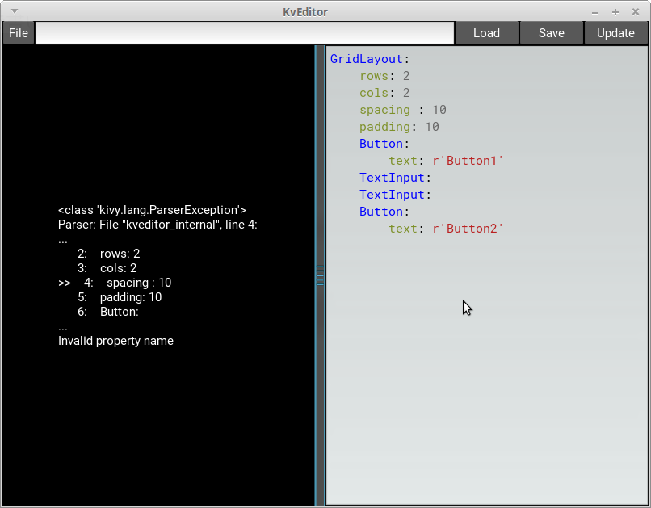

KivyのKvLanguageのコードを、結果をすぐに確認しながら書けるEditorです  
A simple Kv language editor

### 実行に必要なもの(requirements)

- Python3
- Kivy
- Pygments

### 開發環境(Test Environment)

Python3.4.3  
Kivy1.9.1

### Keyboard Shortcuts

以下のShortcutkeyが使えます。

- Ctrl + U = Update
- Ctrl + S = Save
- Ctrl + L = Load

### Q&A

Q. 既にKivy Designerという物があるのに何故わざわざこれを作ったの？  
Why you made this since there's already a Kivy Designer?  
A. 私の環境ではKivy Designerは重い上によく落ちたから  
Cuz It doesn't work well on my PC.  
