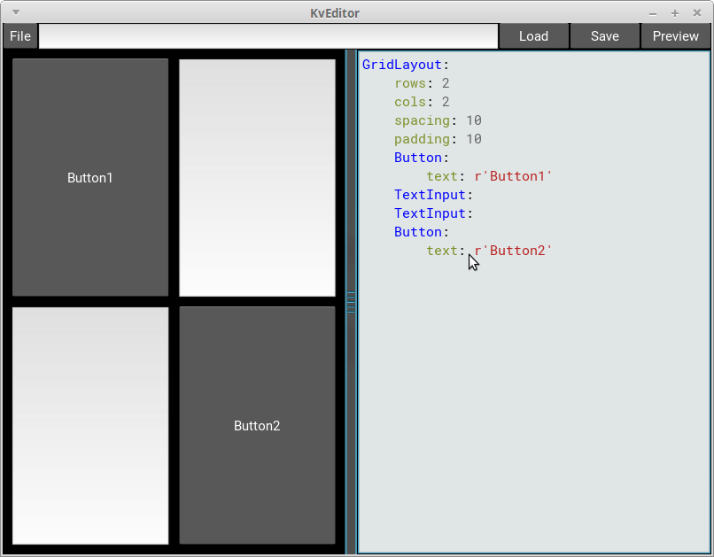

KivyのKvLanguageのコードを、結果をすぐに確認しながら書けるEditorです  
A simple Kv language editor  

Kivy 1.10.0 から追加された[kviewer](https://github.com/kivy/kivy/blob/master/kivy/tools/kviewer.py)によって、このKvEditorは無用の長物と化しました。  
The tool called [kviewer](https://github.com/kivy/kivy/blob/master/kivy/tools/kviewer.py) has been added to Kivy. KvEditor is useless now :-( 

### Test環境(Test Environment)

- Python 3.4.3 + Kivy 1.9.1  
- Python 2.7.6 + Kivy 1.9.1  
- Kivy Launcher (Android App)

### Keyboard Shortcuts (doesn't work on android)

- Ctrl + P = Preview
- Ctrl + S = Save
- Ctrl + L = Load

### その他

Q. 既にKivy Designerという物があるのに何故わざわざこれを作ったの？  
Why you made this since there's already a Kivy Designer?  
A. 私の環境ではKivy Designerは重い上によく落ちたから  
Cuz It doesn't work well on my PC.  

Qiitaにてソースコードの解説もしています(記事:[簡易なKvEditorを作る](http://qiita.com/gotta_dive_into_python/items/d903f10d4afe86868def))  
